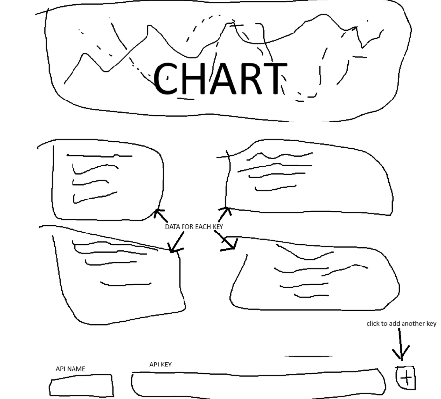
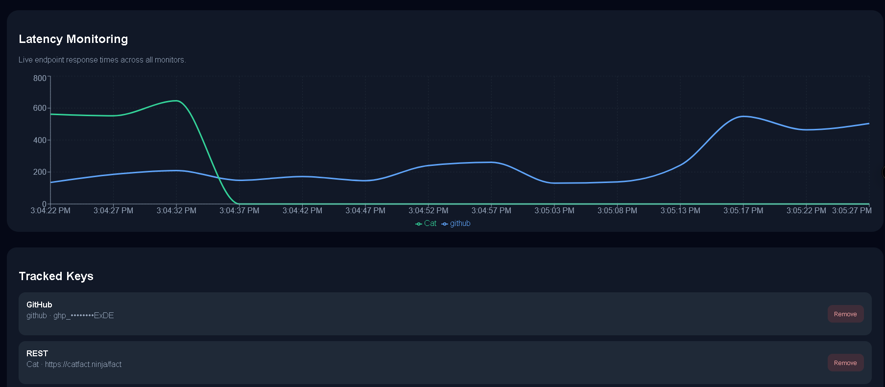
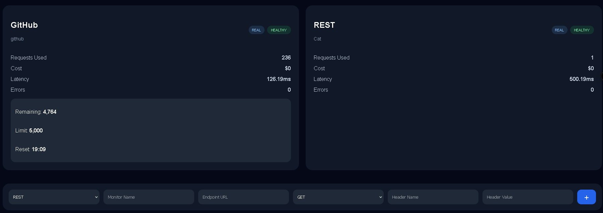

# PulseWatch

PulseWatch is a lightweight observability dashboard for monitoring API and LLM provider usage in real time. It tracks latency, request activity, uptime health, and quota-related metrics across multiple providers through a unified dashboard interface.

The project was built to explore monitoring architecture concepts such as polling systems, provider abstraction, real-time analytics visualization, and frontend/backend deployment pipelines.

---

## Screenshots

### Pre-Development Sketch



---

### Dashboard



---

### Monitoring



## Features

- Real-time API monitoring dashboard
- GitHub API integration with live rate limit tracking
- Generic REST endpoint monitoring support
- Latency visualization with rolling time-series charts
- Live polling architecture
- Multi-provider abstraction system
- Local browser persistence using localStorage
- Fully deployed frontend/backend architecture
- Responsive dark-mode UI

---

## Supported Providers

### Native Integrations
- GitHub

### Generic REST Monitoring
Supports monitoring arbitrary REST endpoints such as:
- PokéAPI
- JSONPlaceholder
- Cat Facts API
- Internal APIs
- Custom endpoints

---

## Architecture

```text
Frontend (Next.js + TypeScript)
        ↓
Polling Requests
        ↓
FastAPI Backend
        ↓
Provider Abstraction Layer
        ↓
External APIs / Services
```

The frontend stores monitor configurations locally in the browser and periodically polls the backend for updated analytics data. The backend normalizes provider responses into a unified analytics format for visualization.

---

## Tech Stack

### Frontend
- Next.js
- TypeScript
- Recharts
- CSS Modules

### Backend
- FastAPI
- Python
- Requests

### Deployment
- Vercel (frontend)
- Render (backend)

---

## Project Structure

```text
pulsewatch/
│
├── backend/
│   ├── providers/
│   ├── main.py
│   └── requirements.txt
│
├── frontend/
│   ├── src/
│   │   ├── app/
│   │   ├── components/
│   │   ├── services/
│   │   └── types/
│   └── package.json
│
└── README.md
```

---

## Running Locally

### Backend

```bash
cd backend

pip install -r requirements.txt

uvicorn main:app --reload
```

Backend runs on:

```text
http://localhost:8000
```

---

### Frontend

```bash
cd frontend

npm install

npm run dev
```

Frontend runs on:

```text
http://localhost:3000
```

---

## Deployment

### Frontend
Deployed on Vercel.

### Backend
Deployed on Render.

Because the backend uses Render's free tier, the API service may take a few seconds to wake up after inactivity.

---

## Future Improvements

- Historical analytics persistence
- Authentication system
- Alert thresholds and notifications
- WebSocket live streaming
- Redis caching layer
- Provider grouping and filtering
- Usage forecasting
- Prometheus/Grafana integrations

---


## Motivation

Most personal observability dashboards either focus heavily on infrastructure monitoring or require significant setup overhead. The goal of PulseWatch was to create a lightweight monitoring layer that could quickly visualize API behavior and provider health through a simple unified interface.